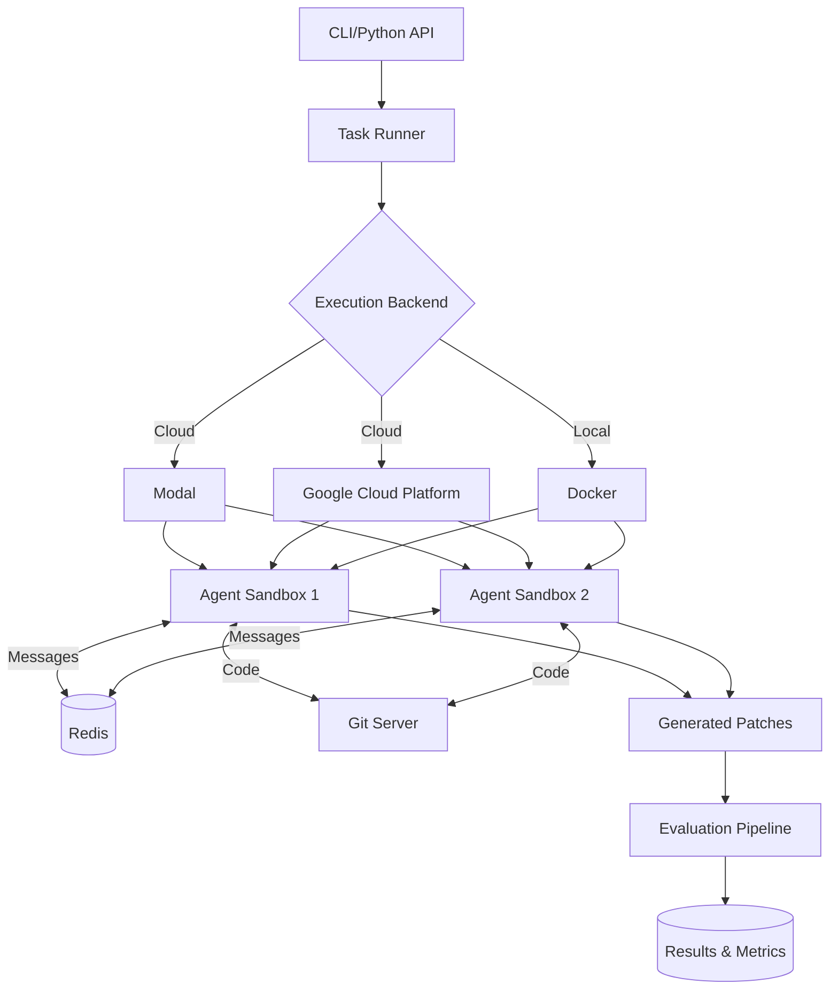
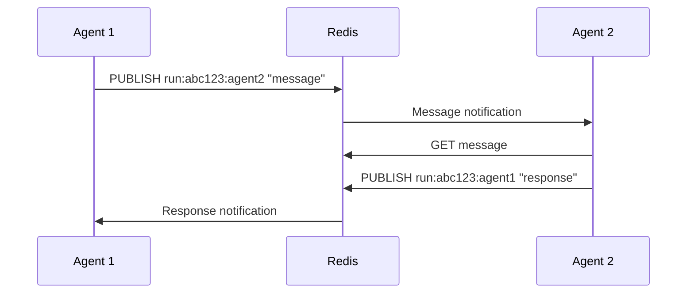
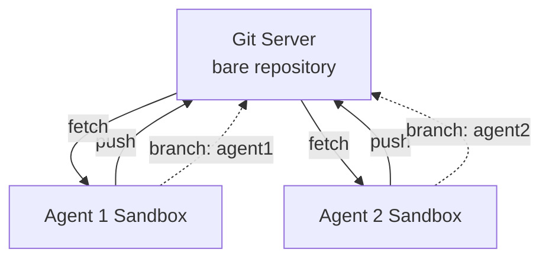
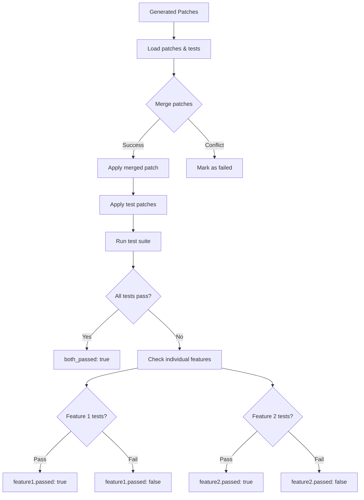
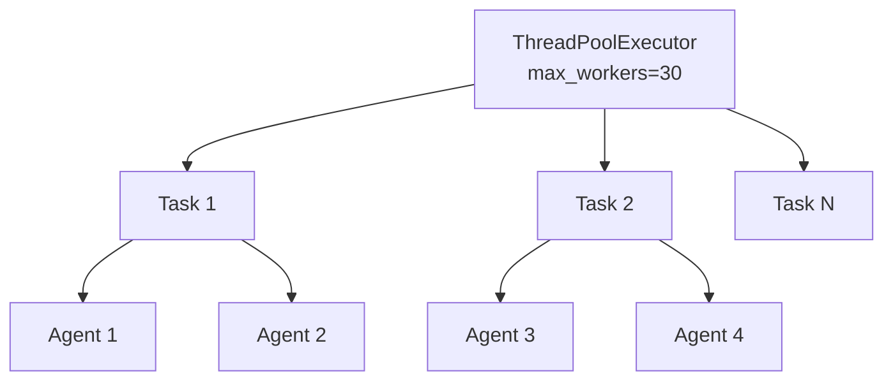

CooperBench is designed as a modular system that can execute agent tasks across different backends while maintaining consistent evaluation standards.

## High-level architecture



## Core components

<CardGroup cols={2}>
  <Card title="Task runner" icon="play">
    Orchestrates task execution, manages concurrency, and tracks results
  </Card>
  <Card title="Execution backends" icon="server">
    Provide isolated sandboxes for agent execution (Modal, GCP, Docker)
  </Card>
  <Card title="Communication layer" icon="comment">
    Redis-based messaging for inter-agent communication
  </Card>
  <Card title="Evaluation pipeline" icon="check">
    Tests merged patches and computes success metrics
  </Card>
</CardGroup>

## Execution backends

CooperBench supports three execution backends, each with different tradeoffs:

<Tabs>
  <Tab title="Modal (default)">
    **Cloud-based serverless execution**
    
    Modal provides managed containerized sandboxes that scale automatically.
    
    **Architecture:**
    ```mermaid
    graph LR
        Local[Local CLI] -->|API| Modal[Modal Cloud]
        Modal --> C1[Container 1]
        Modal --> C2[Container 2]
        C1 --> Results
        C2 --> Results
    ```
    
    **Features:**
    - Automatic scaling to concurrency limits
    - Fast cold starts (~5-10 seconds)
    - Managed infrastructure
    - GPU support available
    - Pay-per-use pricing
    
    **Setup:**
    ```bash
    # Install Modal
    pip install modal
    
    # Authenticate
    modal setup
    
    # Run tasks
    cooperbench run -n exp --backend modal
    ```
    
    **Pros:**
    - Zero infrastructure management
    - Excellent for parallel execution
    - Fast iteration cycles
    - Good for small to medium experiments
    
    **Cons:**
    - Requires internet connection
    - Pay-per-use costs
    - Less control over environment
  </Tab>
  
  <Tab title="Google Cloud Platform">
    **Enterprise cloud execution**
    
    GCP provides VM-based execution with fine-grained control.
    
    **Architecture:**
    ```mermaid
    graph TB
        Local[Local CLI] -->|API| GCP[GCP Batch]
        GCP --> VM1[VM Instance 1]
        GCP --> VM2[VM Instance 2]
        VM1 --> Docker1[Docker Container]
        VM2 --> Docker2[Docker Container]
        Docker1 --> Results
        Docker2 --> Results
    ```
    
    **Features:**
    - VM-based isolation
    - Custom machine types
    - Regional execution
    - Batch job management
    - Enterprise security
    
    **Setup:**
    ```bash
    # Install GCP dependencies
    pip install 'cooperbench[gcp]'
    
    # Configure (interactive wizard)
    cooperbench config gcp
    
    # Run tasks
    cooperbench run -n exp --backend gcp
    ```
    
    **Configuration wizard handles:**
    - GCP authentication
    - Project creation/selection
    - Service account setup
    - API enablement
    - Permissions configuration
    - Validation testing
    
    **Pros:**
    - Production-grade reliability
    - Fine-grained resource control
    - Better for large-scale experiments
    - Integration with GCP services
    
    **Cons:**
    - More complex setup
    - Requires GCP account
    - Higher minimum costs
    - Slower cold starts
  </Tab>
  
  <Tab title="Docker (local)">
    **Local containerized execution**
    
    Docker provides local execution for development and debugging.
    
    **Architecture:**
    ```mermaid
    graph LR
        CLI[CLI] --> Docker[Docker Daemon]
        Docker --> C1[Container 1]
        Docker --> C2[Container 2]
        C1 --> Local[Local Disk]
        C2 --> Local
    ```
    
    **Features:**
    - Local execution
    - Full control over environment
    - No external dependencies
    - Easy debugging
    - Reproducible environments
    
    **Setup:**
    ```bash
    # Ensure Docker is running
    docker ps
    
    # Run tasks
    cooperbench run -n exp --backend docker
    ```
    
    **Pros:**
    - No cloud costs
    - Works offline
    - Full debugging access
    - Fast iteration for development
    
    **Cons:**
    - Limited by local resources
    - Poor parallelization
    - Manual cleanup needed
    - Not suitable for large experiments
  </Tab>
</Tabs>

### Backend comparison

| Feature | Modal | GCP | Docker |
|---------|-------|-----|--------|
| **Setup complexity** | Low | Medium | Low |
| **Concurrency** | High (100+) | High (100+) | Low (CPU-bound) |
| **Cost** | Usage-based | VM-based | Free (local) |
| **Cold start** | ~5-10s | ~30-60s | ~2-5s |
| **Internet required** | Yes | Yes | No |
| **Best for** | Development, medium scale | Production, large scale | Local dev, debugging |

## Agent execution pipeline

When a task runs, CooperBench follows this execution flow:

<Steps>
  <Step title="Task discovery">
    ```python
    # Discover tasks based on filters
    tasks = discover_tasks(
        subset="lite",
        repo_filter="llama_index_task",
        task_filter=None,
        features_filter=None
    )
    # Returns: [{"repo": "...", "task_id": 123, "features": [1, 2]}]
    ```
  </Step>
  
  <Step title="Infrastructure setup">
    - **Redis**: Start or connect to messaging server
    - **Git server** (if enabled): Create shared repository
    - **Namespacing**: Create unique run ID for isolation
  </Step>
  
  <Step title="Sandbox initialization">
    For each agent:
    - Pull task-specific Docker image
    - Mount dataset files
    - Configure environment variables
    - Set up git remote (if enabled)
    - Initialize Redis connection
  </Step>
  
  <Step title="Agent execution">
    ```python
    # Load agent framework
    runner = get_runner("mini_swe_agent")
    
    # Execute task
    result = runner.run(
        task=feature_description,
        image="cooperbench-llama-index-123",
        agent_id="agent1",
        model_name="gpt-4o",
        comm_url="redis://localhost:6379#run:abc123",
        git_server_url="git://git-server:9418",
    )
    ```
  </Step>
  
  <Step title="Patch extraction">
    ```bash
    # Extract changes from agent's workspace
    git diff HEAD > agent1.patch
    ```
  </Step>
  
  <Step title="Result aggregation">
    - Collect patches from all agents
    - Extract conversation messages
    - Compute cost and token metrics
    - Save trajectories and logs
  </Step>
</Steps>

## Redis messaging system

CooperBench uses Redis for real-time agent communication:

### Architecture



### Message flow

<Accordion title="How messaging works">
  1. **Namespacing**: Each run gets unique namespace `run:{run_id}`
  2. **Channels**: Per-agent channels `run:{run_id}:{agent_id}`
  3. **Publishing**: Agent sends message via `send_message` command
  4. **Subscription**: Agents poll for new messages
  5. **Delivery**: Messages appear in agent's context as user messages
  
  **Example:**
  ```python
  # Agent 1 publishes
  redis.publish(
      "run:abc123:agent2",
      json.dumps({"from": "agent1", "message": "Starting feature 1"})
  )
  
  # Agent 2 receives (polled every N steps)
  messages = redis.lrange("run:abc123:agent2:inbox", 0, -1)
  # Appears in context as:
  # "[Message from agent1]: Starting feature 1"
  ```
</Accordion>

### Configuration

```bash
# Use local Redis
cooperbench run -n exp --redis redis://localhost:6379

# Use remote Redis
cooperbench run -n exp --redis redis://cloud.redis.com:6379

# Auto-start Redis via Docker
cooperbench run -n exp  # detects and starts if needed

# Disable messaging
cooperbench run -n exp --no-messaging
```

## Git collaboration mode

Optional git-based code sharing for agents:

### Architecture



### How it works

<Steps>
  <Step title="Server creation">
    ```python
    # Create git server (per task)
    git_server = create_git_server(
        backend="modal",  # or "gcp", "docker"
        run_id="abc123"
    )
    # Returns: url="git://server:9418"
    ```
  </Step>
  
  <Step title="Agent setup">
    ```bash
    # Configure remote in agent sandbox
    git remote add team git://server:9418
    git checkout -b agent1
    git push -u team agent1
    ```
  </Step>
  
  <Step title="Collaboration">
    Agents can use standard git commands:
    ```bash
    # Push changes
    git add .
    git commit -m "Implement feature"
    git push team agent1
    
    # Fetch teammate's work
    git fetch team
    git branch -r  # see team/agent2
    
    # Merge changes
    git merge team/agent2
    ```
  </Step>
  
  <Step title="Cleanup">
    ```python
    # Automatically cleaned up after task
    git_server.cleanup()
    ```
  </Step>
</Steps>

### Backend-specific implementation

<Tabs>
  <Tab title="Modal">
    - Serverless git daemon in Modal sandbox
    - Network-accessible within Modal
    - Automatic cleanup on completion
  </Tab>
  <Tab title="GCP">
    - VM instance with git daemon
    - Internal VPC networking
    - Cleaned up via GCP Batch
  </Tab>
  <Tab title="Docker">
    - Local container with git daemon
    - Docker network bridge
    - Manual cleanup required
  </Tab>
</Tabs>

## Evaluation pipeline

After agents complete tasks, patches are evaluated:

### Evaluation flow



### Evaluation steps

<Steps>
  <Step title="Patch loading">
    ```python
    # Load agent patches
    patch1 = Path("logs/.../agent1.patch").read_text()
    patch2 = Path("logs/.../agent2.patch").read_text()
    
    # Load test patches
    tests1 = Path("dataset/.../feature1/tests.patch").read_text()
    tests2 = Path("dataset/.../feature2/tests.patch").read_text()
    ```
  </Step>
  
  <Step title="Sandbox creation">
    Create isolated test environment:
    - Pull task Docker image
    - Clone repository at correct commit
    - Run setup script
  </Step>
  
  <Step title="Patch application">
    ```bash
    # Apply agent patches
    git apply agent1.patch
    git apply agent2.patch  # may conflict
    
    # Apply test patches
    git apply tests1.patch
    git apply tests2.patch
    ```
  </Step>
  
  <Step title="Test execution">
    ```bash
    # Run complete test suite
    bash run_tests.sh
    ```
  </Step>
  
  <Step title="Result analysis">
    ```python
    result = {
        "both_passed": all_tests_passed,
        "feature1": {
            "passed": feature1_tests_passed,
            "test_output": "..."
        },
        "feature2": {
            "passed": feature2_tests_passed,
            "test_output": "..."
        },
        "merge_conflict": had_conflict,
    }
    ```
  </Step>
</Steps>

### Evaluation backends

Evaluation can run on different backends:

```bash
# Modal (default)
cooperbench eval -n exp --backend modal

# GCP Batch (efficient for large scale)
cooperbench eval -n exp --backend gcp

# Docker (local)
cooperbench eval -n exp --backend docker
```

## Output structure

CooperBench generates comprehensive logs and metrics:

```
logs/{run_name}/
├── config.json                    # Run configuration
├── summary.json                   # Aggregate results
└── {setting}/                     # coop or solo
    └── {repo}/
        └── task{id}/
            └── f{i}_f{j}/         # Feature pair
                ├── result.json         # Task result
                ├── conversation.json   # Messages (coop only)
                ├── agent{i}.patch      # Agent patches
                ├── agent{i}_traj.json  # Trajectories
                └── eval.json           # Test results
```

### Key output files

<AccordionGroup>
  <Accordion title="result.json - Task execution results" icon="file-code">
    ```json
    {
      "repo": "llama_index_task",
      "task_id": 123,
      "features": [1, 2],
      "setting": "coop",
      "total_cost": 0.45,
      "total_steps": 23,
      "duration_seconds": 125.3,
      "agents": {
        "agent1": {
          "feature_id": 1,
          "status": "Submitted",
          "cost": 0.23,
          "steps": 12,
          "patch_lines": 45
        },
        "agent2": {...}
      }
    }
    ```
  </Accordion>
  
  <Accordion title="eval.json - Test results" icon="check">
    ```json
    {
      "both_passed": true,
      "feature1": {
        "passed": true,
        "test_output": "test_cache.py::test_basic PASSED\n..."
      },
      "feature2": {
        "passed": true,
        "test_output": "test_logging.py::test_info PASSED\n..."
      },
      "merge_conflict": false,
      "evaluated_at": "2026-03-04T10:30:00"
    }
    ```
  </Accordion>
  
  <Accordion title="conversation.json - Inter-agent messages" icon="messages">
    ```json
    [
      {
        "from": "agent1",
        "to": "agent2",
        "message": "I'm working on caching in src/cache.py",
        "timestamp": 1234567890,
        "feature_id": 1
      },
      {
        "from": "agent2",
        "to": "agent1",
        "message": "Got it, I'll handle logging separately",
        "timestamp": 1234567895,
        "feature_id": 2
      }
    ]
    ```
  </Accordion>
</AccordionGroup>

## Concurrency and parallelization

CooperBench executes multiple tasks in parallel:

```python
# Run with 30 parallel tasks
cooperbench run -n exp --concurrency 30

# Each task may spawn 2 agents (coop mode)
# Total: up to 60 concurrent sandboxes
```

### Concurrency architecture



Backend handles spawning and managing agent sandboxes based on concurrency limits.

## What's next?

<CardGroup cols={2}>
  <Card title="Quick start" icon="rocket" href="/quickstart">
    Run your first benchmark with the architecture you learned
  </Card>
  
  <Card title="Backend setup" icon="server" href="/setup">
    Configure Modal, GCP, or Docker backends
  </Card>
  
  <Card title="Dataset structure" icon="database" href="/concepts/dataset">
    Understand how tasks are organized
  </Card>
  
  <Card title="CLI reference" icon="terminal" href="/cli-reference">
    Complete command-line options and parameters
  </Card>
</CardGroup>
