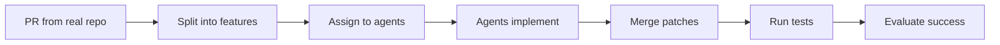

CooperBench is the first benchmark designed to measure how well AI agents can cooperate when handling individual tasks with potential conflicts. It addresses a fundamental question: **Can AI agents work together as teammates?**

## The multi-agent coordination problem

As AI coding agents become more capable, the natural progression is to have multiple agents work together on complex software projects. However, coordination introduces unique challenges:

<CardGroup cols={2}>
  <Card title="Shared codebase conflicts" icon="code-merge">
    Multiple agents modifying the same files simultaneously can create merge conflicts and introduce bugs
  </Card>
  <Card title="State synchronization" icon="rotate">
    Agents must understand what their teammates are doing and integrate that information into their own work
  </Card>
  <Card title="Communication overhead" icon="messages">
    Agents need to decide when and how to communicate, balancing information sharing with task execution
  </Card>
  <Card title="Commitment reliability" icon="handshake">
    Agents must make reliable promises about their work and follow through on commitments
  </Card>
</CardGroup>

## Key findings

Research using CooperBench has revealed significant coordination deficits:

<Note>
**Coordination deficit**: GPT-5 and Claude Sonnet 4.5 achieve only **25% success** with two-agent cooperation, roughly **50% lower** than when a single agent handles both tasks.
</Note>

Three fundamental capability gaps underlie these coordination failures:

<AccordionGroup>
  <Accordion title="Expectation failures (42%)" icon="brain">
    Agents fail to properly integrate information about their partner's state. They may:
    - Ignore messages from teammates
    - Make assumptions that conflict with communicated plans
    - Fail to update their mental model based on partner actions
  </Accordion>
  
  <Accordion title="Communication failures (26%)" icon="comment-slash">
    Questions go unanswered and information doesn't flow properly. Issues include:
    - Asymmetric communication (one agent sends, the other doesn't respond)
    - Unclear or ambiguous messages
    - Missing critical information about implementation details
  </Accordion>
  
  <Accordion title="Commitment failures (32%)" icon="circle-xmark">
    Agents break promises or make unverifiable claims:
    - Promising to implement features in a certain way, then doing something different
    - Making commitments without following through
    - Creating dependencies that don't materialize
  </Accordion>
</AccordionGroup>

## How CooperBench evaluates agents

CooperBench uses real-world pull requests from open-source repositories, split into independent features that agents must implement simultaneously.

### Evaluation methodology

Each benchmark task follows this process:



1. **Task selection**: Each task is derived from a real pull request that introduced multiple features
2. **Feature assignment**: Features are assigned to different agents (cooperative) or one agent (solo)
3. **Implementation**: Agents work in isolated sandboxes with optional communication channels
4. **Integration**: Agent patches are merged together
5. **Testing**: Original test suites verify correctness
6. **Scoring**: Success requires both features to pass all tests without conflicts

### Success criteria

A task is considered successful when:

<Steps>
  <Step title="Individual correctness">
    Each agent's patch passes its own feature tests
  </Step>
  <Step title="Merge compatibility">
    Patches can be merged without conflicts (or conflicts are resolved correctly)
  </Step>
  <Step title="Joint correctness">
    The merged code passes all tests for both features
  </Step>
</Steps>

## Cooperative vs solo settings

CooperBench supports two evaluation modes to measure the coordination deficit:

<CodeGroup>
```bash Cooperative (2 agents)
cooperbench run -n my-experiment -r llama_index_task -m gpt-4o --setting coop
```

```bash Solo (1 agent)
cooperbench run -n my-experiment -r llama_index_task -m gpt-4o --setting solo
```
</CodeGroup>

### Cooperative setting

- **2 agents** work simultaneously
- Each agent implements **one feature**
- Agents can **communicate** via Redis messaging
- Optional **git collaboration** for code sharing
- Measures real-world coordination challenges

### Solo setting

- **1 agent** implements **both features** sequentially
- No communication or coordination needed
- Provides baseline performance without coordination overhead
- Same total workload as cooperative setting

<Info>
**Why compare?** The performance gap between solo and cooperative settings quantifies the "coordination deficit" - how much capability is lost due to coordination challenges.
</Info>

## Communication and collaboration

Agents in cooperative mode have access to multiple collaboration mechanisms:

### Redis messaging

Agents can send structured messages to teammates:

```bash
send_message agent2 "I'm implementing the cache layer in src/cache.py"
```

Messages appear in the receiving agent's context:

```
[Message from agent1]: I'm implementing the cache layer in src/cache.py
```

<Note>
Research shows agents spend up to **20% of their budget** on communication, which reduces merge conflicts but doesn't significantly improve overall success rates.
</Note>

### Git collaboration (optional)

When enabled with `--git`, agents can:

- Push code to a shared repository
- Fetch teammate branches
- Merge changes from other agents
- Resolve conflicts through git

This mirrors real developer workflows but adds complexity to the coordination challenge.

## What's next?

Now that you understand how CooperBench evaluates multi-agent coordination:

<CardGroup cols={2}>
  <Card title="Dataset structure" icon="database" href="/concepts/dataset">
    Explore the 652 tasks across 12 repositories
  </Card>
  <Card title="Settings comparison" icon="code-compare" href="/concepts/settings">
    Deep dive into cooperative vs solo evaluation modes
  </Card>
  <Card title="System architecture" icon="diagram-project" href="/concepts/architecture">
    Learn how CooperBench executes and evaluates tasks
  </Card>
  <Card title="Quick start" icon="rocket" href="/quickstart">
    Run your first benchmark evaluation
  </Card>
</CardGroup>
