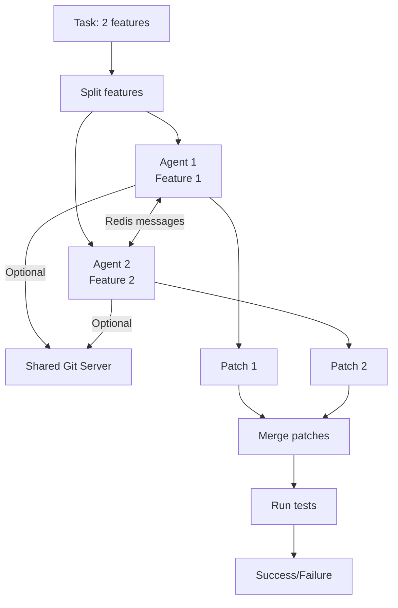
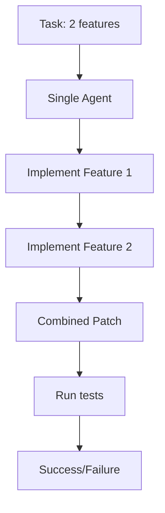

CooperBench supports two evaluation settings that enable measuring the "coordination deficit" - the performance gap between individual and collaborative agent work.

## Setting comparison

<CardGroup cols={2}>
  <Card title="Cooperative setting" icon="users">
    **2 agents** collaborate on separate features with communication
  </Card>
  <Card title="Solo setting" icon="user">
    **1 agent** implements both features sequentially
  </Card>
</CardGroup>

### Quick comparison

| Aspect | Cooperative | Solo |
|--------|-------------|------|
| **Number of agents** | 2 | 1 |
| **Features per agent** | 1 | 2 |
| **Total workload** | Same | Same |
| **Communication** | Redis messaging | None |
| **Git collaboration** | Optional | N/A |
| **Concurrency** | Parallel execution | Sequential |
| **Complexity** | High (coordination) | Low (isolation) |

## Cooperative setting

In cooperative mode, two agents work simultaneously on separate features, simulating a team development scenario.

### Architecture



### How it works

<Steps>
  <Step title="Feature assignment">
    Each of the two features is assigned to a separate agent. Agents work in isolated sandboxes.
  </Step>
  
  <Step title="Parallel execution">
    Both agents start simultaneously and work in parallel, implementing their assigned features.
  </Step>
  
  <Step title="Communication (optional)">
    Agents can send messages to each other via Redis:
    ```bash
    send_message agent2 "I'm modifying src/cache.py for feature 1"
    ```
  </Step>
  
  <Step title="Git collaboration (optional)">
    With `--git` flag, agents can push/pull/merge code:
    ```bash
    git push team agent1
    git fetch team
    git merge team/agent2
    ```
  </Step>
  
  <Step title="Patch generation">
    Each agent produces a patch file with their changes.
  </Step>
  
  <Step title="Merge and evaluate">
    Patches are merged together and tested to verify both features work correctly.
  </Step>
</Steps>

### Running cooperative mode

<CodeGroup>
```bash CLI
cooperbench run \
  -n my-experiment \
  -r llama_index_task \
  -m gpt-4o \
  --setting coop
```

```python Python API
from cooperbench import run

run(
    run_name="my-experiment",
    repo="llama_index_task",
    model_name="gpt-4o",
    setting="coop",
    redis_url="redis://localhost:6379",
    messaging_enabled=True,
    git_enabled=False
)
```
</CodeGroup>

### Communication mechanisms

Agents in cooperative mode have two ways to collaborate:

<Tabs>
  <Tab title="Redis messaging">
    **Default communication channel** for inter-agent messages
    
    **Features:**
    - Async message passing
    - Namespaced by run ID
    - Messages appear in agent context
    - Tracked in conversation logs
    
    **Example flow:**
    ```bash
    # Agent 1 sends
    send_message agent2 "Working on authentication in auth.py"
    
    # Agent 2 receives (appears in context)
    [Message from agent1]: Working on authentication in auth.py
    
    # Agent 2 responds
    send_message agent1 "Got it, I'll handle validation in validators.py"
    ```
    
    <Note>
    Research shows agents spend up to **20% of their budget** on messaging, reducing conflicts but not significantly improving success rates.
    </Note>
  </Tab>
  
  <Tab title="Git collaboration">
    **Optional code-sharing mechanism** enabled with `--git`
    
    **Features:**
    - Shared git server per task
    - Standard git commands (push, pull, fetch, merge)
    - Agent-specific branches
    - Mirrors real developer workflows
    
    **Example flow:**
    ```bash
    # Agent 1 commits and pushes
    git add src/auth.py
    git commit -m "Add authentication"
    git push team agent1
    
    # Agent 2 fetches and merges
    git fetch team
    git merge team/agent1
    # ... resolve conflicts if needed ...
    ```
    
    <Warning>
    Git collaboration adds complexity and often decreases success rates as agents struggle with conflict resolution.
    </Warning>
  </Tab>
</Tabs>

### Configuration options

```bash
# Enable messaging (default)
cooperbench run -n exp --setting coop

# Disable messaging
cooperbench run -n exp --setting coop --no-messaging

# Enable git collaboration
cooperbench run -n exp --setting coop --git

# Custom Redis URL
cooperbench run -n exp --setting coop --redis redis://custom:6379
```

## Solo setting

In solo mode, a single agent implements both features sequentially, providing a baseline without coordination overhead.

### Architecture



### How it works

<Steps>
  <Step title="Combined task">
    Both feature descriptions are combined into a single prompt:
    ```markdown
    ## Feature 1
    Add caching support...
    
    ---
    
    ## Feature 2  
    Add logging functionality...
    ```
  </Step>
  
  <Step title="Sequential implementation">
    The agent implements both features in a single session, with full context of both requirements.
  </Step>
  
  <Step title="Unified patch">
    Agent produces a single patch containing all changes for both features.
  </Step>
  
  <Step title="Evaluation">
    Tests for both features are run against the combined patch.
  </Step>
</Steps>

### Running solo mode

<CodeGroup>
```bash CLI
cooperbench run \
  -n my-experiment \
  -r llama_index_task \
  -m gpt-4o \
  --setting solo
```

```python Python API
from cooperbench import run

run(
    run_name="my-experiment",
    repo="llama_index_task",
    model_name="gpt-4o",
    setting="solo"
)
```
</CodeGroup>

### Advantages

<CardGroup cols={2}>
  <Card title="No coordination overhead" icon="gauge-high">
    Agent doesn't need to communicate or merge with others
  </Card>
  <Card title="Full context" icon="eye">
    Agent sees both feature requirements upfront
  </Card>
  <Card title="Simpler execution" icon="circle-check">
    No messaging, git servers, or merge conflicts
  </Card>
  <Card title="Baseline performance" icon="chart-line">
    Shows maximum achievable without coordination
  </Card>
</CardGroup>

## When to use each setting

<Tabs>
  <Tab title="Use cooperative when...">
    <CheckGroup>
      - Evaluating multi-agent coordination capabilities
      - Measuring real-world team collaboration
      - Testing communication strategies
      - Researching conflict resolution
      - Benchmarking against coordination baseline
    </CheckGroup>
  </Tab>
  
  <Tab title="Use solo when...">
    <CheckGroup>
      - Establishing baseline performance
      - Testing agent capability without coordination
      - Comparing to cooperative results
      - Debugging task difficulty
      - Quick iteration on agent improvements
    </CheckGroup>
  </Tab>
</Tabs>

## Understanding the coordination deficit

The performance gap between settings reveals coordination challenges:

<Note>
**Coordination deficit formula:**
```
Deficit = (Solo Success Rate - Coop Success Rate) / Solo Success Rate
```

**Example:** If solo achieves 50% and coop achieves 25%:
```
Deficit = (0.50 - 0.25) / 0.50 = 0.50 (50% deficit)
```
</Note>

### Research findings

<AccordionGroup>
  <Accordion title="GPT-4o performance" icon="chart-line">
    - **Solo:** ~50% success rate
    - **Cooperative:** ~25% success rate  
    - **Deficit:** 50% performance loss due to coordination
  </Accordion>
  
  <Accordion title="Claude Sonnet 4.5 performance" icon="chart-line">
    - **Solo:** ~45% success rate
    - **Cooperative:** ~22% success rate
    - **Deficit:** 51% performance loss due to coordination
  </Accordion>
  
  <Accordion title="Communication impact" icon="messages">
    - Agents use 10-20% of budget on messaging
    - Reduces merge conflicts by ~15%
    - Does **not** improve overall success rates
    - Indicates communication quality issues
  </Accordion>
</AccordionGroup>

## Output structure

Results are organized differently per setting:

<CodeGroup>
```bash Cooperative logs
logs/my-experiment/coop/llama_index_task/task123/f1_f2/
├── result.json          # Overall task result
├── conversation.json    # Inter-agent messages
├── agent1.patch         # Agent 1's changes
├── agent2.patch         # Agent 2's changes  
├── agent1_traj.json     # Agent 1's trajectory
├── agent2_traj.json     # Agent 2's trajectory
└── eval.json            # Test results
```

```bash Solo logs
logs/my-experiment/solo/llama_index_task/task123/f1_f2/
├── result.json          # Overall task result
├── solo.patch           # Combined patch
├── solo_traj.json       # Agent trajectory
└── eval.json            # Test results
```
</CodeGroup>

## Comparing results

After running both settings, compare results:

```python
import json
from pathlib import Path

# Load results
coop_result = json.loads(Path("logs/exp/coop/.../result.json").read_text())
solo_result = json.loads(Path("logs/exp/solo/.../result.json").read_text())

# Compare metrics
print(f"Cooperative cost: ${coop_result['total_cost']:.2f}")
print(f"Solo cost: ${solo_result['total_cost']:.2f}")

print(f"Cooperative steps: {coop_result['total_steps']}")
print(f"Solo steps: {solo_result['total_steps']}")

# Load evaluations
coop_eval = json.loads(Path("logs/exp/coop/.../eval.json").read_text())
solo_eval = json.loads(Path("logs/exp/solo/.../eval.json").read_text())

print(f"Cooperative passed: {coop_eval['both_passed']}")
print(f"Solo passed: {solo_eval['both_passed']}")
```

## What's next?

<CardGroup cols={2}>
  <Card title="System architecture" icon="diagram-project" href="/concepts/architecture">
    Learn how settings are executed under the hood
  </Card>
  
  <Card title="Run experiments" icon="flask" href="/quickstart">
    Start running benchmarks with different settings
  </Card>
  
  <Card title="CLI reference" icon="terminal" href="/cli-reference">
    Complete command options for both settings
  </Card>
  
  <Card title="Dataset overview" icon="database" href="/concepts/dataset">
    Explore the benchmark task structure
  </Card>
</CardGroup>
